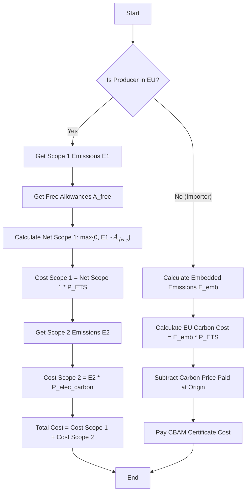
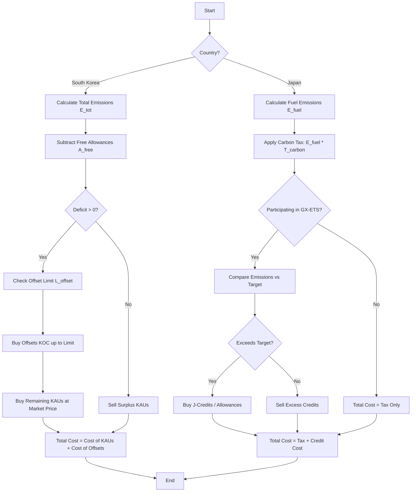
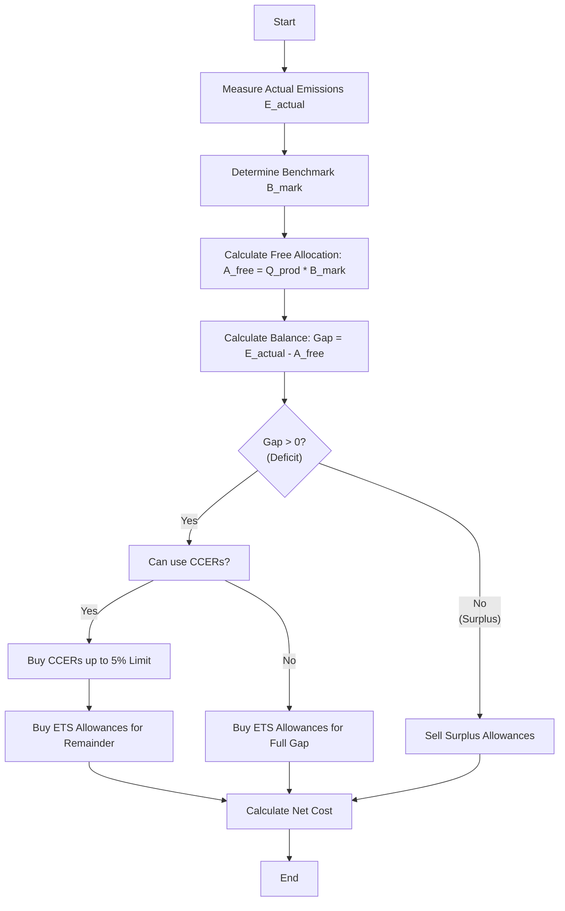
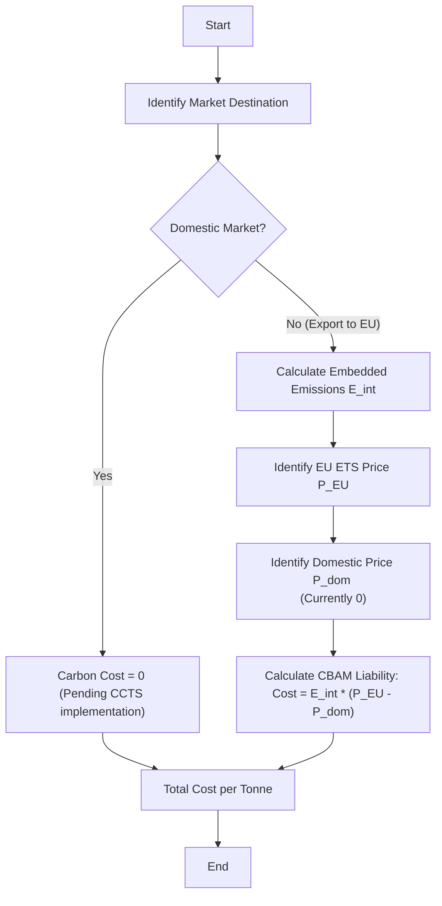
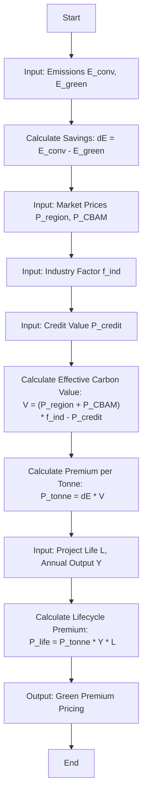

# Carbon Pricing Algorithms for the Steel Sector

Based on the industry report and analysis, this document outlines carbon pricing algorithms for five specific scenarios.

## 1. The Case of Europe

### Explanation
In Europe, steel producers operate under the **EU Emissions Trading System (EU ETS)**. They must surrender allowances for their **Scope 1** (direct) emissions. **Scope 2** (indirect electricity) costs are passed through in power prices. Historically, producers received **Free Allowances** to prevent carbon leakage, but these are being phased out (ending by roughly 2030-2034).

For imports into the EU, the **Carbon Border Adjustment Mechanism (CBAM)** applies. Importers must pay the difference between the EU ETS price and any carbon price paid in the country of origin.

**Algorithm Logic:**
1.  Calculate **Scope 1 Cost**: (Scope 1 Emissions - Free Allowances) × EU ETS Price.
2.  Calculate **Scope 2 Cost**: Scope 2 Emissions × (Pass-through Carbon Cost in Electricity).
3.  **Total Domestic Cost** = Scope 1 Cost + Scope 2 Cost.
4.  **CBAM (for imports):** (Embedded Emissions × EU ETS Price) - (Carbon Price Paid at Origin).

### Inputs and Outputs
*   **Inputs:**
    *   $E_{scope1}$: Scope 1 Emissions (tCO2/t Steel)
    *   $E_{scope2}$: Scope 2 Emissions (tCO2/t Steel)
    *   $P_{ETS}$: EU ETS Allowance Price (€/tCO2)
    *   $A_{free}$: Free Allowances allocated (tCO2/t Steel)
    *   $P_{elec\_carbon}$: Carbon cost component in electricity price (€/tCO2)
*   **Output:**
    *   $C_{total}$: Total Carbon Cost per Tonne of Steel (€/t)

### Flowchart

---

## 2. The Case of Japan and South Korea

### Explanation
This region has a split approach:
*   **South Korea (K-ETS):** A mandatory Cap-and-Trade system covering Scope 1 and indirect Scope 2. Producers receive free allowances (KAUs) but allocations are shrinking (Phase 4). They can use limited offsets (KOCs).
*   **Japan:** Currently relies on a low **Carbon Tax** (Tax for Climate Change Mitigation) and a voluntary **GX-ETS** (transitioning to mandatory). Producers may use **J-Credits** to offset emissions. Incentives exist for "Green Steel" in the auto sector.

### Inputs and Outputs
*   **Inputs (Korea):**
    *   $E_{total}$: Total Emissions (Scope 1 + 2)
    *   $A_{free}$: Free Allowances (KAUs)
    *   $P_{KAU}$: K-ETS Price (KRW/tCO2)
    *   $L_{offset}$: Max Offset Limit (%)
*   **Inputs (Japan):**
    *   $E_{fuel}$: Emissions from Fuel (Scope 1)
    *   $T_{carbon}$: Carbon Tax Rate (¥/tCO2)
    *   $P_{GX}$: GX-ETS / J-Credit Price (if participating)
*   **Output:**
    *   $C_{total}$: Total Carbon Cost per Tonne of Steel

### Flowchart

---

## 3. The Case of China

### Explanation
China operates a **National ETS** that is expanding to cover steel. Currently, it is an intensity-based system where allowances are **freely allocated** based on benchmarks (e.g., tCO2 per tonne of product).
*   If a plant is more efficient than the benchmark, it earns surplus allowances.
*   If less efficient, it must buy allowances.
*   **CCERs (China Certified Emission Reductions)** can be used to offset a small percentage (approx. 5%) of compliance obligations.

### Inputs and Outputs
*   **Inputs:**
    *   $Q_{prod}$: Production Output (tonnes)
    *   $E_{actual}$: Actual Emissions (tCO2)
    *   $B_{mark}$: Benchmark Intensity (tCO2/t product)
    *   $P_{ETS}$: China ETS Price (CNY/tCO2)
    *   $P_{CCER}$: CCER Offset Price
*   **Output:**
    *   $C_{compliance}$: Net Compliance Cost (or Revenue)

### Flowchart

---

## 4. The Case of India

### Explanation
India currently has **no explicit national carbon tax** or mandatory ETS for steel (though the **CCTS** is in development). The primary carbon-related cost driver is the **EU CBAM** for exports.
*   **Domestic Sales:** Implicit carbon price is effectively zero (legacy coal cess removed).
*   **Exports to EU:** Must pay the EU CBAM charge, which is the EU ETS price minus any domestic carbon price paid (currently 0).

### Inputs and Outputs
*   **Inputs:**
    *   $Q_{dom}$: Quantity sold domestically
    *   $Q_{exp}$: Quantity exported to EU
    *   $E_{int}$: Emission Intensity (tCO2/t Steel)
    *   $P_{EU}$: EU ETS Price
    *   $P_{dom}$: Domestic Carbon Price (currently ~0)
*   **Output:**
    *   $C_{weighted}$: Weighted Average Carbon Cost per Tonne

### Flowchart

---

## 5. Proposed Algorithm: Green Premium Calculation

### Explanation
This algorithm calculates the **Green Premium**—the additional price a low-carbon steel product should command (or the cost gap it needs to bridge). It accounts for regional carbon prices, the "Green" value in specific industries (Industry Factor), avoided CBAM costs, and potential revenue from carbon credits.

**Formula:**
$$ \text{Premium}_{\text{per tonne}} = \Delta E \times [ (P_{\text{region}} + P_{\text{CBAM}}) \times f_{\text{ind}} - P_{\text{credit}} ] $$

Where:
*   $\Delta E$: Emissions saved per tonne (Conventional - Low Carbon).
*   $P_{\text{region}}$: Local carbon price avoided.
*   $P_{\text{CBAM}}$: Avoided border tax (if applicable).
*   $f_{\text{ind}}$: Industry willingness-to-pay factor (>1).
*   $P_{\text{credit}}$: Revenue from selling carbon credits.

### Inputs and Outputs
*   **Inputs:**
    *   $E_{conv}, E_{green}$: Emissions of conventional vs. green steel
    *   $P_{region}$: Local Carbon Price
    *   $P_{CBAM}$: Target Market Carbon Price (if exporting)
    *   $f_{ind}$: Industry Factor (e.g., 1.2 for Auto)
    *   $P_{credit}$: Value of Carbon Credits
    *   $L, Y$: Project Lifetime (years), Annual Production
*   **Output:**
    *   $Prem_{tonne}$: Premium per Tonne ($)
    *   $Prem_{life}$: Total Lifecycle Premium ($)

### Flowchart

