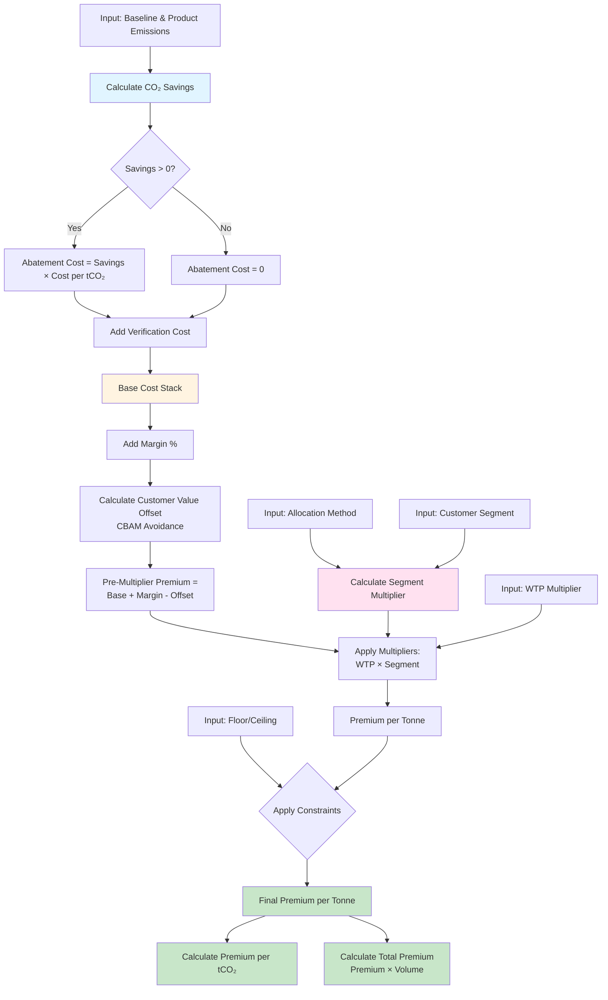
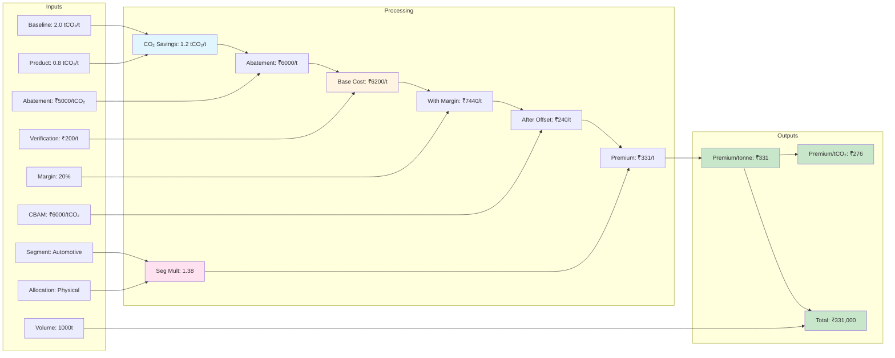
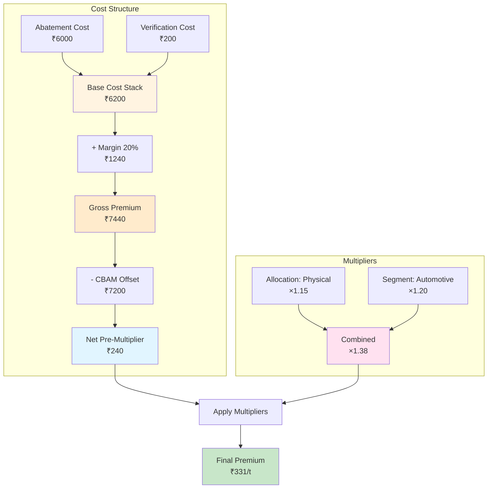

# Green Steel Premium Calculator - Mathematical Model Documentation

## Overview

The calculator determines the **premium price** customers should pay for green steel (lower emissions) compared to conventional steel, based on cost-plus pricing with market adjustments.

## Inputs

### Primary Emissions Parameters
- **`baseline_emission`** (tCO₂/t): CO₂ emissions from conventional steel production
- **`product_emission`** (tCO₂/t): CO₂ emissions from the green steel product

### Cost Parameters
- **`abatement_cost_per_tco2`** (₹/tCO₂): Cost to reduce emissions by one tonne of CO₂
- **`verification_cost_per_tonne`** (₹/t): Fixed cost per tonne for verification and administration
- **`margin_pct`** (%): Profit margin percentage

### Market Adjustment Parameters
- **`customer_segment`**: "automotive", "construction", or "other"
- **`allocation_method`**: "physical" or "certificate" 
- **`cbam_avoidance_per_tco2`** (₹/tCO₂): Value customers gain from avoiding CBAM (Carbon Border Adjustment Mechanism) costs
- **`willingness_to_pay_multiplier`**: Market adjustment factor (e.g., 1.2 = 20% higher willingness)

### Volume & Constraints
- **`volume_tonnes`** (t): Total volume of steel
- **`floor_premium_per_t`** (₹/t): Minimum premium per tonne
- **`ceiling_premium_per_t`** (₹/t): Maximum premium per tonne (optional)

### Metadata
- **`product_type`**: "HRC", "GI", or "Other" (for tracking only)

---

## Mathematical Formulas

### Step 1: CO₂ Savings Calculation

$$\text{CO₂ Savings} = \max(0, \text{baseline\_emission} - \text{product\_emission})$$

### Step 2: Cost Components

**Abatement Component:**
$$\text{Abatement Cost} = \text{CO₂ Savings} \times \text{abatement\_cost\_per\_tCO₂}$$

**Verification Component:**
$$\text{Verification Cost} = \text{verification\_cost\_per\_tonne}$$

**Base Cost Stack:**
$$\text{Base Cost} = \text{Abatement Cost} + \text{Verification Cost}$$

### Step 3: Margin Addition

$$\text{Margin Component} = \text{Base Cost} \times \frac{\text{margin\_pct}}{100}$$

### Step 4: Customer Value Offset

$$\text{Customer Value Offset} = \text{CO₂ Savings} \times \text{cbam\_avoidance\_per\_tCO₂}$$

This represents the value customers capture by avoiding CBAM taxes, which reduces the premium they'll pay.

### Step 5: Pre-Multiplier Premium

$$\text{Pre-Multiplier Premium} = \text{Base Cost} + \text{Margin Component} - \text{Customer Value Offset}$$

### Step 6: Segment Multiplier Calculation

$$\text{Segment Multiplier} = \text{allocation\_factor} \times \text{customer\_segment\_factor}$$

Where:
- **Allocation factor**: 1.15 for "physical", 1.0 for "certificate"
- **Segment factor**: 1.2 for "automotive", 1.05 for "construction", 1.0 for "other"

### Step 7: Final Premium Calculation

$$\text{Premium per Tonne} = \text{Pre-Multiplier Premium} \times \text{willingness\_to\_pay} \times \text{Segment Multiplier}$$

**With floor and ceiling constraints:**
$$\text{Final Premium} = \min(\max(\text{Premium}, \text{floor}), \text{ceiling})$$

### Step 8: Derived Metrics

**Premium per tCO₂ saved:**
$$\text{Premium per tCO₂} = \frac{\text{Premium per Tonne}}{\text{CO₂ Savings}}$$

**Total premium for volume:**
$$\text{Total Premium} = \text{Premium per Tonne} \times \text{volume\_tonnes}$$

---

## Process Flow Diagram

## Data Flow with Example Values

## COmponent Breakdown

