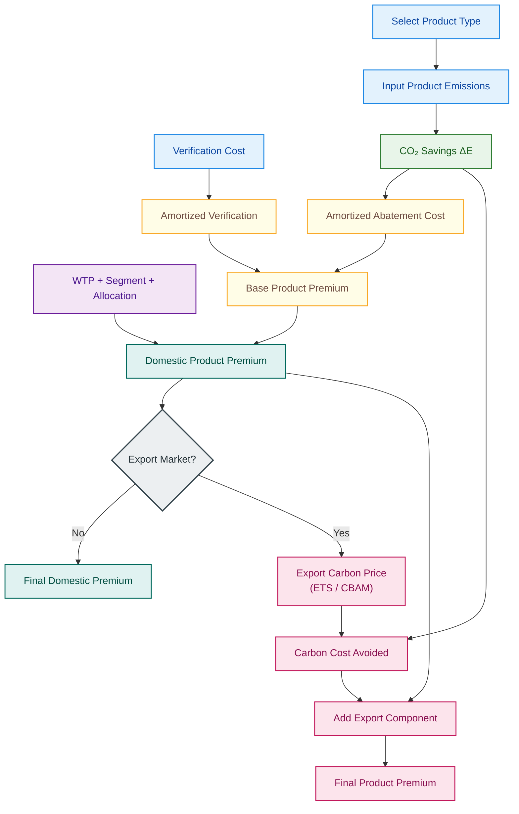

# Green Steel Premium Calculator  

Link to web app - https://green-steel-app.fly.dev/
## Domestic + Export Pricing Model (Product-Specific)

---

## 1. Objective

This model computes a **green premium for steel products** sold in:

- Domestic Indian market
- Export markets subject to carbon pricing (EU CBAM, Korea ETS, Japan GX)

The premium is:
- **Product-specific** (HRC, GI, TMT, Other)
- **Amortized over project lifecycle**
- **Adjusted for market willingness to pay**
- **Extended for export carbon cost pass-through**

---

## 2. Product Types Covered

| Product Type | Typical End Use | Emissions Sensitivity |
|-------------|----------------|----------------------|
| HRC | Automotive, Fabrication | High |
| GI | Construction, Appliances | Medium |
| TMT | Infrastructure | Medium |
| Other | Specialty steels | Variable |

Each product may differ in:
- baseline emissions
- achievable emission reduction
- customer WTP

---

## 3. Model Inputs

### 3.1 Product Parameters
- **product_type** ∈ {HRC, GI, TMT, Other}
- **baseline_emission** (tCO₂/t steel)
- **product_emission** (tCO₂/t steel)

---

### 3.2 Project & Cost Parameters
- **abatement_cost_per_tco2** (₹/tCO₂)
- **project_lifetime_years**
- **verification_cost_per_year** (₹/year)
- **annual_steel_production_tonnes**

---

### 3.3 Market Parameters
- **willingness_to_pay_multiplier**
- **customer_segment** ∈ {automotive, construction, other}
- **allocation_method** ∈ {physical, certificate}

---

### 3.4 Export Parameters (Optional)
- **export_market** ∈ {Domestic, EU, South Korea, Japan}
- **carbon_price_export** (₹/tCO₂)
- **free_allowance_factor**
- **volume_tonnes**

---

## 4. Mathematical Formulation

### Step 1: CO₂ Savings (Product-Specific)

$$
\Delta E_{product} = \max(0,\; E_{baseline,product} - E_{green,product})
$$

---

### Step 2: Amortized Domestic Cost

$$
C_{abatement} =
\frac{C_{abatement/tCO₂} \times \Delta E_{product}}{L}
$$

$$
C_{verification} =
\frac{C_{verification/year}}{Q_{annual}}
$$

$$
P_{base,product} = C_{abatement} + C_{verification}
$$

---

### Step 3: Market Multipliers

$$
M_{total} =
M_{WTP} \times M_{segment} \times M_{allocation}
$$

$$
P_{domestic,product} = P_{base,product} \times M_{total}
$$

---

### Step 4: Export Carbon Cost Avoided (if applicable)

$$
P_{carbon,export} =
\Delta E_{product} \times P_{carbon}^{export}
\times (1 - f_{free})
$$

---

### Step 5: Final Premium

$$
P_{final,product} =
P_{domestic,product} + P_{carbon,export}
$$

$$
Total\ Premium = P_{final,product} \times Volume
$$

---

## 5. End-to-End Process Flow

## 6. Export Market Assumptions

| Market      | Carbon Price | Free Allowance |
| ----------- | ------------ | -------------- |
| EU (CBAM)   | EU ETS       | 0%             |
| South Korea | K-ETS        | 30%            |
| Japan       | GX / Tax     | 80%            |

## 7. Outputs

- Product-wise premium (₹/t)
- Premium per tCO₂ saved
- Total order premium
- Transparent cost breakdown

