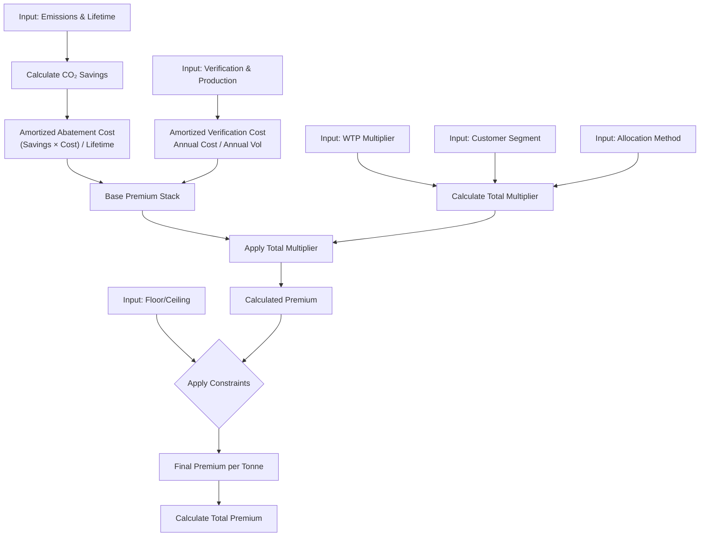
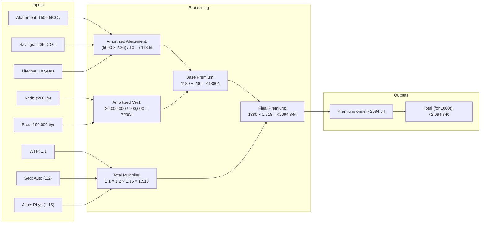
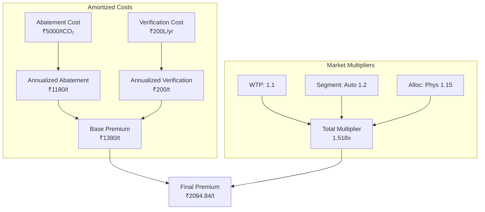

# Green Steel Premium Calculator - Mathematical Model Documentation

## Overview

The calculator determines the **premium price** customers should pay for green steel (lower emissions) compared to conventional steel. The model uses an **amortized cost approach**, spreading the capital cost of decarbonization and verification over the project lifecycle. This base cost is then adjusted by multipliers for **Willingness-to-Pay (WTP)**, **Customer Segment**, and **Allocation Method**.

## Inputs

### Primary Emissions Parameters
- **`baseline_emission`** (tCO₂/t): CO₂ emissions from conventional steel production (e.g., ~2.36 tCO₂/t)
- **`product_emission`** (tCO₂/t): CO₂ emissions from the green steel product

### Project & Cost Parameters
- **`abatement_cost_per_tco2`** (₹/tCO₂): Capital/Abatement cost to reduce emissions by one tonne of CO₂
- **`project_lifetime_years`** (years): Amortization period for the project (default: 10 years)
- **`verification_cost_per_year`** (₹/year): Annual fixed cost for verification and administration
- **`annual_steel_production_tonnes`** (t/year): Annual production volume of the plant

### Market Adjustment Parameters
- **`willingness_to_pay_multiplier`** (factor): General market adjustment factor (e.g., 1.2 for 20% margin/markup).
- **`customer_segment`**: "automotive", "construction", or "other".
- **`allocation_method`**: "physical" or "certificate".

### Volume & Constraints
- **`volume_tonnes`** (t): Total volume of steel for a specific order
- **`floor_premium_per_t`** (₹/t): Minimum premium per tonne
- **`ceiling_premium_per_t`** (₹/t): Maximum premium per tonne (optional)

---

## Mathematical Formulas

### Step 1: CO₂ Savings Calculation

$$\text{CO₂ Savings} = \max(0, \text{baseline\_emission} - \text{product\_emission})$$

### Step 2: Amortized Cost Components

**Annualized Abatement Cost per Tonne:**
This spreads the abatement cost (viewed as upfront or lifecycle cost) over the project lifetime.

$$\text{Amortized Abatement} = \frac{\text{abatement\_cost\_per\_tCO₂} \times \text{CO₂ Savings}}{\text{project\_lifetime\_years}}$$

**Annualized Verification Cost per Tonne:**
Spreads fixed annual verification costs over the annual production volume.

$$\text{Amortized Verification} = \frac{\text{verification\_cost\_per\_year}}{\text{annual\_steel\_production\_tonnes}}$$

### Step 3: Base Premium Calculation

$$\text{Base Premium} = \text{Amortized Abatement} + \text{Amortized Verification}$$

### Step 4: Segment & Allocation Multipliers

The model applies specific multipliers based on the customer type and delivery method.

**Allocation Factor:**
- **Physical**: 1.15 (Premium for physical delivery)
- **Certificate**: 1.0

**Segment Factor:**
- **Automotive**: 1.20
- **Construction**: 1.05
- **Other**: 1.0

$$\text{Total Multiplier} = \text{willingness\_to\_pay\_multiplier} \times \text{Allocation Factor} \times \text{Segment Factor}$$

### Step 5: Final Premium Calculation

The base cost is adjusted by the total multiplier.

$$\text{Final Premium per Tonne} = \text{Base Premium} \times \text{Total Multiplier}$$

**With floor and ceiling constraints:**
$$\text{Final Premium} = \min(\max(\text{Calculated Premium}, \text{floor}), \text{ceiling})$$

### Step 6: Derived Metrics

**Premium per tCO₂ saved:**
$$\text{Premium per tCO₂} = \frac{\text{Final Premium per Tonne}}{\text{CO₂ Savings}}$$

**Total premium for volume:**
$$\text{Total Premium} = \text{Final Premium per Tonne} \times \text{volume\_tonnes}$$

---

## Process Flow Diagram

## Data Flow with Example Values

Based on the example: Abatement ₹5000/tCO₂, Intensity 2.36 (Savings), Lifetime 10y, Verification ₹20,000,000/yr, Output 100k t/yr.
**Market Inputs**: WTP 1.1x, Segment: Automotive (1.2x), Allocation: Physical (1.15x).

## Component Breakdown

