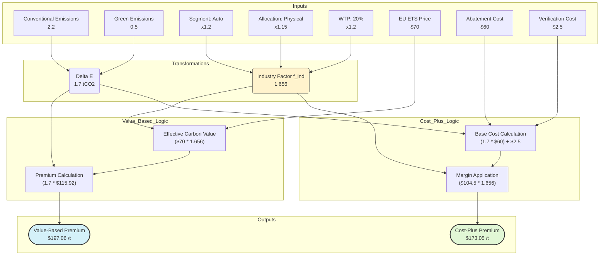
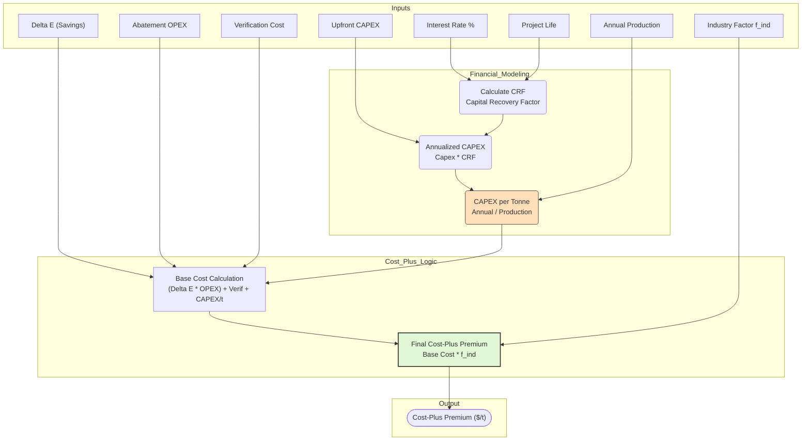

# Green Premium Calculator Logic

## 1. Logic Explanation

The calculator determines the "Green Premium" (the extra price a customer pays for low-carbon steel) using two different approaches simultaneously:

1.  **Value-Based Approach:** Calculates the premium based on the **regulatory cost avoided** (e.g., not paying carbon taxes) and the **market value** created for the customer (e.g., Scope 3 reduction value).
2.  **Cost-Plus Approach:** Calculates the premium based on the **production cost increase** (abatement technology) plus a commercial margin.

Both approaches are adjusted by a unified **Industry Factor ($f_{ind}$)**, which represents commercial leverage based on the customer segment, allocation method, and willingness to pay.

## 2. Example Scenario: "Automotive Client in Europe"

Let's trace the numbers for a hypothetical deal with a European car manufacturer.

**Inputs:**
*   **Emissions Savings ($\Delta E$):**
    *   Conventional Steel ($E_{conv}$): 2.2 tCO2/t
    *   Green Steel ($E_{green}$): 0.5 tCO2/t
    *   **$\Delta E$ = 1.7 tCO2/t**
*   **Market Factors:**
    *   Segment: **Automotive** (Multiplier: 1.2x)
    *   Allocation: **Physical** (Multiplier: 1.15x)
    *   Willingness to Pay (WTP): **20%** (Multiplier: 1.2x)
*   **Regulatory Costs:**
    *   EU ETS Price ($P_{region}$): **$70/tCO2**
*   **Production Costs:**
    *   Abatement Cost: **$60/tCO2**
    *   Verification Cost: **$2.50/t steel**

**Step-by-Step Transformation:**

1.  **Calculate Industry Factor ($f_{ind}$):**
    $$f_{ind} = 1.2 \text{ (Auto)} \times 1.15 \text{ (Physical)} \times 1.2 \text{ (WTP)} = \mathbf{1.656}$$

2.  **Path A: Value-Based Premium**
    *   *Effective Carbon Value:* $(70 + 0) \times 1.656 - 0 = \$115.92 / tCO2$
    *   *Final Premium:* $1.7 \text{ (Savings)} \times 115.92 = \mathbf{\$197.06 / t \text{ steel}}$

3.  **Path B: Cost-Plus Premium**
    *   *Base Cost:* $(1.7 \times 60) + 2.5 = \$104.50$
    *   *Final Premium:* $104.50 \times 1.656 = \mathbf{\$173.05 / t \text{ steel}}$

## 3. Data Flow Diagram (Mermaid)

## 4. Updated Logic: CAPEX Amortization (Project Finance)

The calculator has been updated to refine the **Cost-Plus Approach** by incorporating **Capital Expenditure (CAPEX)** amortization. This ensures that the massive upfront investments required for green steel plants (e.g., Hydrogen DRI) are spread over the project`s life and reflected in the per-tonne premium.

### New Inputs
*   **Upfront CAPEX ($):** Total investment required for the green transition.
*   **Cost of Capital (r):** The interest rate or discount rate.
*   **Project Life (n):** Duration of the project in years.
*   **Annual Production:** Expected output in tonnes per year.

### Amortization Formula
The tool uses the **Capital Recovery Factor (CRF)** to convert the lump-sum CAPEX into an equivalent annual cost.

1.  **Calculate CRF:**
    $$CRF = \frac{r(1+r)^n}{(1+r)^n - 1}$$
2.  **Annualized CAPEX:**
    $$Annual\_CAPEX = Upfront\_CAPEX \times CRF$$
3.  **CAPEX per Tonne:**
    $$CAPEX_{unit} = \frac{Annual\_CAPEX}{Annual\_Production}$$
4.  **Revised Base Cost (Cost-Plus):**
    $$Base\_Cost = (\Delta E \times OPEX_{abatement}) + Verification + CAPEX_{unit}$$

### Updated Data Flow (Mermaid)

