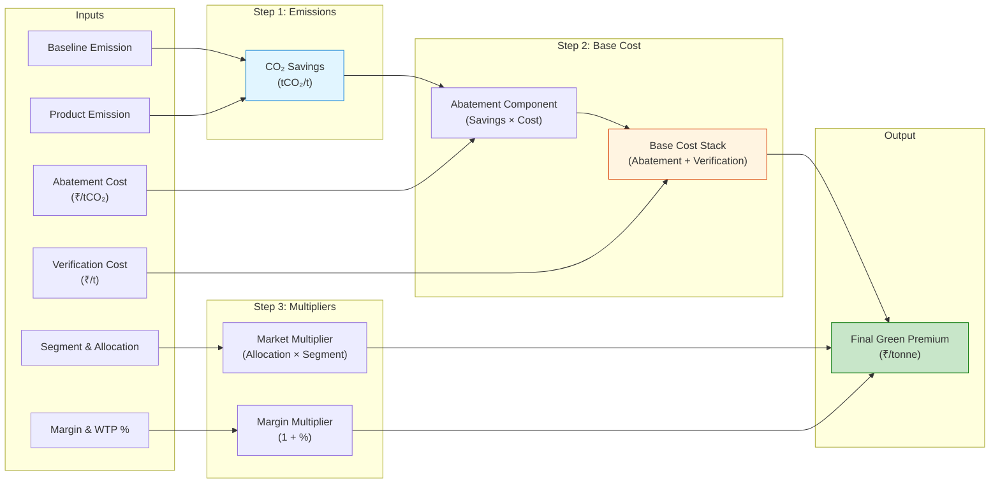

# notes on updating the algorithm

## Current Algorithm

The model calculates a **Green Premium** (an extra price per tonne) that a customer pays for low-carbon steel. It uses a **"Cost-Plus-Value"** approach, starting with the cost of decarbonization and then adjusting for market factors.

The calculation follows these four steps:

1.  **Calculate CO₂ Savings**:
    It determines the physical reduction in emissions by comparing the **Baseline Emission** (conventional steel) with the **Product Emission** (green steel).
    *   *Formula:* `Savings = Baseline - Product`

2.  **Determine Base Cost Stack**:
    This represents the manufacturer's cost to produce the green attribute.
    *   **Abatement Component**: The cost to remove that amount of CO₂ (`Savings × Abatement Cost per tCO₂`).
    *   **Verification Component**: A fixed administrative fee per tonne for certifying the emissions.
    *   *Formula:* `Base Cost = Abatement Component + Verification Component`

3.  **Apply Market Multipliers**:
    The model scales the base cost up based on commercial factors:
    *   **Margin & Willingness-to-Pay (WTP)**: A percentage markup (e.g., 20%) representing profit and customer willingness to pay.
    *   **Allocation Method**: A multiplier based on how the green steel is delivered (e.g., **1.15x** for Physical delivery vs. **1.0x** for Certificates).
    *   **Customer Segment**: A multiplier based on the industry (e.g., **1.2x** for Automotive, **1.05x** for Construction).

4.  **Final Premium**:
    The final premium is the Base Cost multiplied by all the factors above.

> **Note:** The provided Python code is a simplified version of the logic described in the `README.md`. The code currently **excludes** the "CBAM Avoidance" (Carbon Border Adjustment Mechanism) offset and combines the Margin and WTP into a single multiplier.

### Visual Diagram

Here is the flow of the model as implemented in the code:

