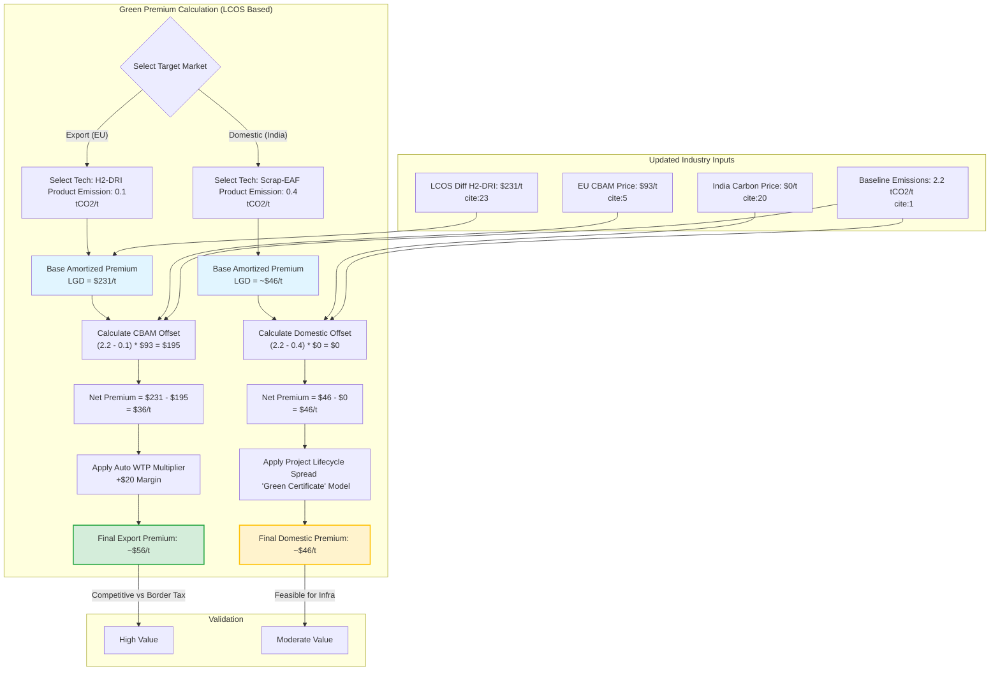

```mermaid
graph TD
    subgraph Inputs ["Updated Industry Inputs"]
        I1[LCOS Diff H2-DRI: $231/t <br/> cite:23] 
        I2[EU CBAM Price: $93/t <br/> cite:5]
        I3[India Carbon Price: $0/t <br/> cite:20]
        I4[Baseline Emissions: 2.2 tCO2/t <br/> cite:1]
    end

    subgraph Core_Algorithm ["Green Premium Calculation (LCOS Based)"]
        Start{Select Target Market}
        
        %% Export Logic
        Start -->|"Export (EU)"| Tech1[Select Tech: H2-DRI <br/> Product Emission: 0.1 tCO2/t]
        Tech1 --> Cost1[Base Amortized Premium <br/> LGD = $231/t]
        Cost1 --> Offset1["Calculate CBAM Offset <br/> (2.2 - 0.1) * $93 = $195"]
        Offset1 --> Net1[Net Premium = $231 - $195 <br/> = $36/t]
        Net1 --> WTP1[Apply Auto WTP Multiplier <br/> +$20 Margin]
        WTP1 --> Final1[Final Export Premium: ~$56/t]

        %% Domestic Logic
        Start -->|"Domestic (India)"| Tech2[Select Tech: Scrap-EAF <br/> Product Emission: 0.4 tCO2/t]
        Tech2 --> Cost2[Base Amortized Premium <br/> LGD = ~$46/t]
        Cost2 --> Offset2["Calculate Domestic Offset <br/> (2.2 - 0.4) * $0 = $0"]
        Offset2 --> Net2[Net Premium = $46 - $0 <br/> = $46/t]
        Net2 --> Amort2[Apply Project Lifecycle Spread <br/> 'Green Certificate' Model]
        Amort2 --> Final2[Final Domestic Premium: ~$46/t]
    end

    subgraph Validation
        Final1 --"Competitive vs Border Tax"--> Valid1[High Value]
        Final2 --"Feasible for Infra"--> Valid2[Moderate Value]
    end

    I1 --> Cost1
    I2 --> Offset1
    I3 --> Offset2
    I4 --> Offset1
    I4 --> Offset2

    style Final1 fill:#d4edda,stroke:#28a745,stroke-width:2px
    style Final2 fill:#fff3cd,stroke:#ffc107,stroke-width:2px
    style Cost1 fill:#e1f5ff
    style Cost2 fill:#e1f5ff
```